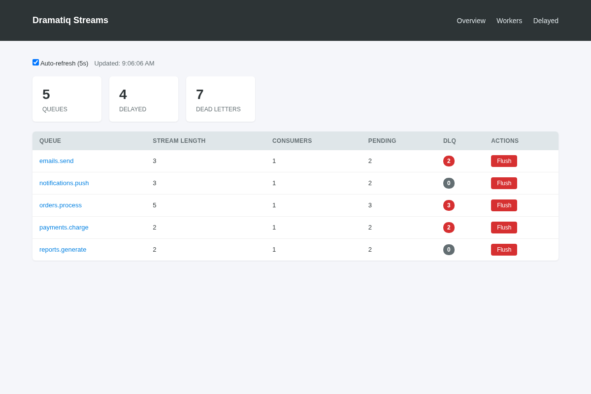
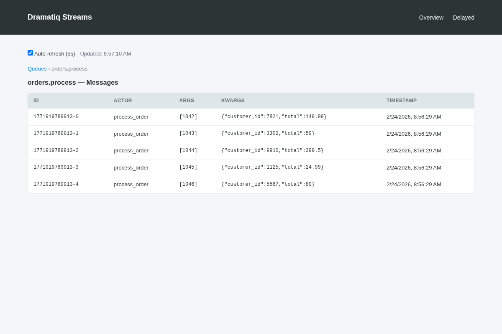
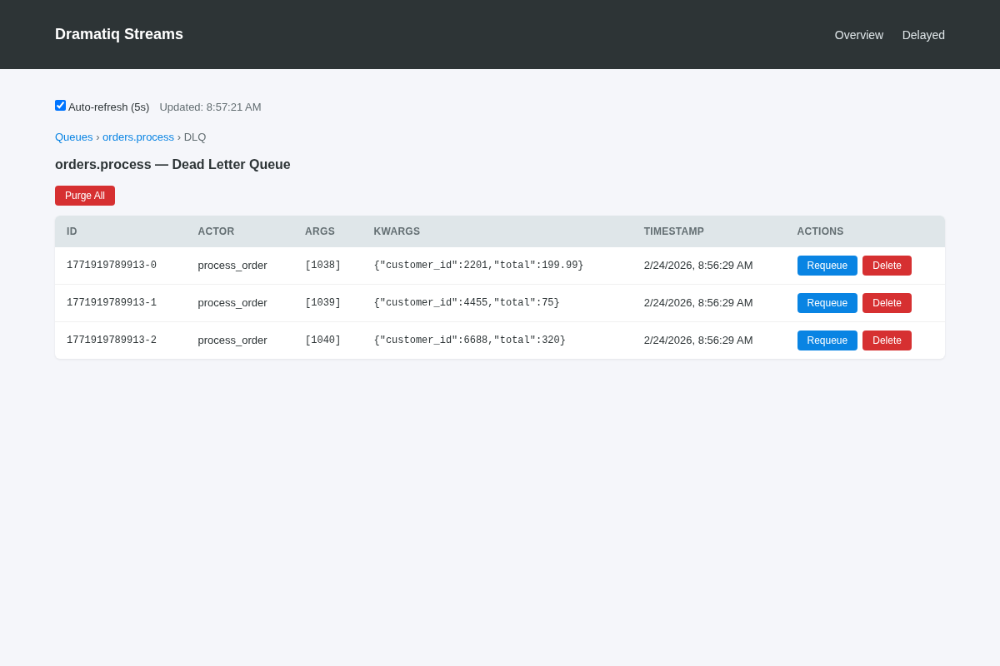
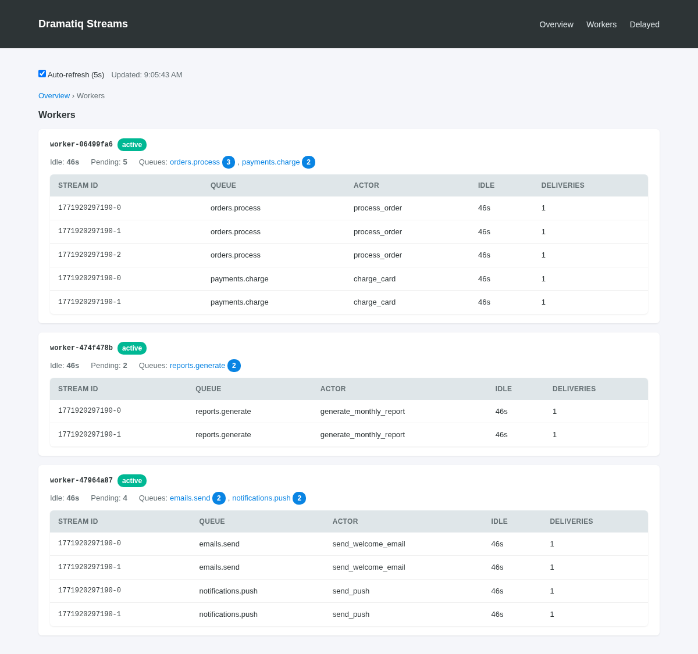
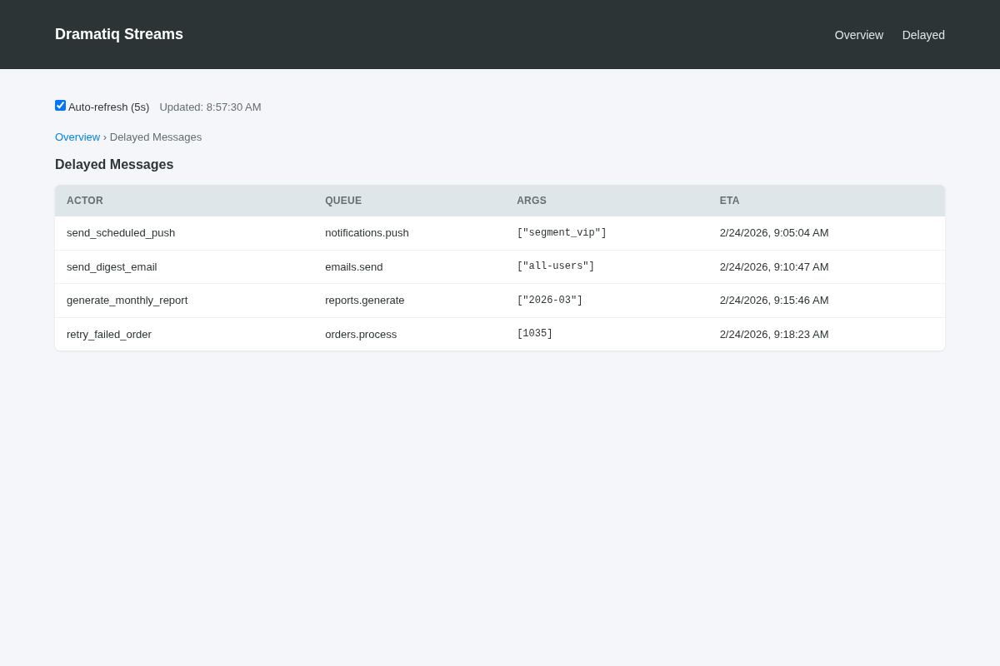

# dramatiq-redis-streams

A [Redis Streams](https://redis.io/docs/data-types/streams-tutorial/) broker for [Dramatiq](https://dramatiq.io/).

Replaces Dramatiq's built-in `RedisBroker` (which polls with Lua scripts) with an event-driven implementation using `XREADGROUP BLOCK` — zero CPU when idle, deterministic failure recovery, and fewer Redis connections.

## Why

| Aspect | Built-in RedisBroker | This broker |
|---|---|---|
| Consumption | Lua LPOP + exponential backoff | `XREADGROUP BLOCK` (event-driven) |
| Delivery tracking | Custom ack set in Lua | Redis Streams PEL (built-in) |
| Dead worker recovery | Probabilistic (0.1% per poll) | Per-task deadline (never steals a task within its `time_limit`) |
| Delayed messages | Per-queue `.DQ` list + Lua poll | Single sorted set + 1 scheduler thread |
| Dead letter | Custom sorted set + Lua | DLQ stream per queue |
| Idle Redis ops/sec | ~48 EVALSHA/sec | ~1/sec (scheduler only) |

Requires **Redis >= 7.0**.

## Installation

```bash
pip install dramatiq-redis-streams
```

Or from source:

```bash
pip install git+https://github.com/sylvinus/dramatiq-redis-streams.git
```

## Quick Start

```python
import dramatiq
from dramatiq_redis_streams import StreamsBroker

broker = StreamsBroker(url="redis://localhost:6379/0")
dramatiq.set_broker(broker)

@dramatiq.actor
def add(x, y):
    print(f"Result: {x + y}")

# Send a message
add.send(1, 2)

# Send with a delay (milliseconds)
add.send_with_options(args=(3, 4), delay=5000)
```

Run workers with the standard Dramatiq CLI:

```bash
dramatiq my_module
```

## Configuration

```python
StreamsBroker(
    url="redis://localhost:6379/0",  # Redis URL (ignored if client is set)
    client=None,                      # Pre-configured redis.Redis instance
    middleware=None,                   # Dramatiq middleware list (None = defaults)
    namespace="dramatiq",             # Key prefix for all Redis keys
    default_time_limit=600000,        # Reclaim fallback when no TimeLimit middleware (10 min)
    reclaim_grace=10000,              # Extra time past a task's deadline before reclaim
    reclaim_interval=30000,           # Time between orphan-recovery sweeps
)
```

All broker time values are in **milliseconds**, matching dramatiq (`time_limit`, `delay`, etc.).

### Task timeouts and recovery

A message is only recovered from a worker once it has been unacked for longer
than **that task's own deadline** — its `time_limit` (per actor or per message),
plus `reclaim_grace`. A worker legitimately running a task within its declared
`time_limit` is therefore never robbed of it.

The reclaim deadline stays in lock-step with dramatiq's in-worker abort: a task
that declares no `time_limit` is aborted by dramatiq's `TimeLimit` middleware
**and** reclaimed by the broker at the same point — dramatiq's default, **10
minutes**. Swapping `RedisBroker` for `StreamsBroker` changes no timeout. Set a
per-task limit to move both together:

```python
@dramatiq.actor(time_limit=300000)   # 5 minutes; abort AND reclaim deadline
def slow_task(): ...
```

The broker never mutates your `TimeLimit` middleware — it reads its configured
limit. The `default_time_limit` argument is only a fallback, used when your
custom `middleware` stack contains no `TimeLimit` at all (no in-worker abort to
track).

### Dead-letter retention (`dead_message_ttl`)

Dead-lettered messages are kept for **7 days** by default, then auto-deleted —
matching dramatiq's reference brokers (and honoring the same
`dramatiq_dead_message_ttl` env var). Override per task, so noisy failures expire
sooner while important ones are kept forever (`dead_message_ttl=0`):

```python
@dramatiq.actor(dead_message_ttl=3_600_000)   # forget this task's failures after 1h
def scrape(url): ...

@dramatiq.actor(dead_message_ttl=0)           # keep these failures forever
def charge_card(account): ...
```

Also settable per message via `send_with_options(dead_message_ttl=…)` and
broker-wide via `StreamsBroker(dead_message_ttl=…)`. Expired entries are dropped
by the scheduler thread — cheap, since they're indexed by expiry, so messages
kept forever are never scanned. (The dashboard still calls this queue "Failed".)

### Redis Data Model

| Key | Type | Purpose |
|---|---|---|
| `{namespace}:stream:{queue}` | Stream | Main message queue |
| `{namespace}:delayed` | Sorted Set | Delayed messages (score = ETA in ms) |
| `{namespace}:dlq:{queue}` | Stream | Dead-letter queue per queue |
| `{namespace}:queues` | Set | Registry of known queues (for dashboard discovery) |

Consumer group `workers` on each stream, consumer name `worker-{broker_id}` per process.

The queue registry is populated by **workers** (on `consume`) and read by the
dashboard, so a queue appears in the dashboard once a worker has started
consuming it — not merely when messages are enqueued to it.

## Delivery guarantees & idempotency

This broker — like Dramatiq, and essentially every Redis-backed queue — is
**at-least-once**, not exactly-once. A message stays in the consumer group's
pending list until the task acknowledges it *after* running, so a worker crash
never loses it — but the same task **can run more than once**:

- a worker dies mid-task → another worker reclaims and re-runs it;
- a task outlives its `time_limit` → it may be reclaimed and run again;
- a Redis failover loses the un-replicated ack → the task re-runs.

Exactly-once delivery isn't achievable here (it isn't anywhere); the correct
pattern is **at-least-once + idempotent tasks**. Make any task with side effects
safe to run twice: use an idempotency key for external calls (payments, emails,
non-idempotent APIs), upsert instead of insert, check-before-act. Naturally
idempotent tasks (recompute-and-store, read-only checks) need nothing.

## Production Redis requirements

A queue is not a cache. Two Redis settings are **mandatory**, or you will
silently lose tasks:

- **`maxmemory-policy noeviction`.** Any eviction policy (`allkeys-lru`,
  `volatile-*`, …) lets Redis delete your stream, pending, and delayed keys
  under memory pressure — tasks vanish with no error. If you share a Redis with
  an eviction-enabled cache, **use a separate instance (or database) for the
  queue.**
- **Persistence (`appendonly yes`).** Without the AOF, a Redis crash drops any
  writes not yet snapshotted to RDB. Enable AOF so enqueued-but-unprocessed
  messages survive a restart.

Also worth knowing:

- **Failover can lose recent writes.** Redis replication is asynchronous, so a
  Sentinel/Cluster failover may drop the last few messages and ack/PEL updates.
  Idempotent tasks (above) keep this safe, but a task acked just before failover
  may re-run.
- **Back-pressure is on you.** The broker never caps queue length (dropping
  tasks would be wrong), so if producers outrun consumers the stream grows until
  Redis runs out of memory. Monitor the dashboard's **Waiting** backlog and
  scale workers — don't reach for eviction as a relief valve (see above).
- **Connection pool.** Each consumed queue holds one connection blocked in
  `XREADGROUP`. If you set `max_connections`, keep it above
  `(queues consumed) + (worker threads)`, or acks can stall waiting for a free
  connection.

## Dashboard

A built-in web dashboard for monitoring queues, inspecting messages, and managing dead-letter queues. Zero additional dependencies. It shows per-queue **backlog** (undelivered) and **throughput** (acked/sec, 1-min average), per-worker **reserved** messages, and offers **Flush**/**Remove**, plus DLQ **Requeue All**/**Purge All**.

> **⚠️ Security.** The dashboard exposes **destructive, unauthenticated** endpoints (flush, remove, purge, requeue) and serves task payloads. It performs **no authentication or CSRF protection** itself — the Django helper is even `csrf_exempt`. **You must put it behind authentication and network restrictions** (e.g. an authenticated reverse proxy, IP allowlist, or your framework's auth). Never expose it publicly.



### Standalone

```bash
python -m dramatiq_redis_streams.dashboard --redis-url redis://localhost:6379/0 --port 8080
```

### Django Integration

```python
# urls.py
from dramatiq_redis_streams.dashboard import get_urlpatterns
from myapp import broker

urlpatterns += get_urlpatterns(broker, prefix="dramatiq/")
```

### Programmatic (WSGI)

```python
from dramatiq_redis_streams.dashboard import DashboardApp

app = DashboardApp(broker, prefix="/dashboard")
# Mount with any WSGI server (gunicorn, uwsgi, etc.)
```

### Views

**Queue detail** — stream ID, actor, args/kwargs, and timestamp for each message:



**Dead Letter Queue** — failed messages with Requeue and Delete actions, plus bulk Purge:



**Workers** — live worker processes with status, queues, idle time, and pending message details. The per-worker in-progress list shows a first page and a **Load more** button that pages through the rest with a Redis stream-ID cursor (each request bounded, no matter how many a worker holds):



**Delayed messages** — scheduled messages with their ETAs:



## Development

All development uses Docker — no host Python required.

```bash
# Run tests
make test

# Run tests with verbose output
make test-verbose

# Open a shell in the container
make shell

# Lint
make lint

# Clean up
make clean
```

### Running a specific test

```bash
docker compose run --rm test pytest tests/test_broker.py -v
```

## Architecture

### Consumer (`StreamsConsumer`)

Each consumer thread calls `XREADGROUP GROUP workers {id} BLOCK {timeout} COUNT {prefetch} STREAMS {key} >`. This blocks efficiently on the Redis server — the thread uses zero CPU while waiting.

The consumer never holds more than `prefetch` delivered-but-unacked messages at once (dramatiq sets `prefetch = worker_threads × 2` by default). This cap is enforced in the broker because dramatiq's internal work queue is unbounded — without it, one worker would siphon an entire backlog into its own pending-entries list and starve other workers. As a result, adding worker processes actually distributes a full queue.

Every `reclaim_interval` ms (default 30 000), the consumer sweeps the group's pending entry list (`XPENDING`) for messages owned by **other** workers that have been unacked longer than their own task deadline (`time_limit` + `reclaim_grace`), and `XCLAIM`s those — recovering work from dead workers without ever stealing a task a live worker is still within-deadline on. A worker never reclaims its own messages. Separately, the scheduler thread reaps fully-drained consumer records that have been idle beyond an hour via `XGROUP DELCONSUMER`.

### Message Lifecycle

- **ack**: `XACK` + `XDEL` (removes from PEL and frees stream memory)
- **nack**: `XADD` to DLQ stream, then `XACK` + `XDEL` from main stream
- **requeue**: `XADD` new entry + `XACK` + `XDEL` old entry (atomic via pipeline)

### Delayed Messages (`DelayedScheduler`)

One daemon thread per worker process polls the `{namespace}:delayed` sorted set every second. Due messages (score ≤ now) are atomically removed with `ZREM` and added to their target stream with `XADD`. Multiple processes can safely run schedulers concurrently.

## License

MIT
